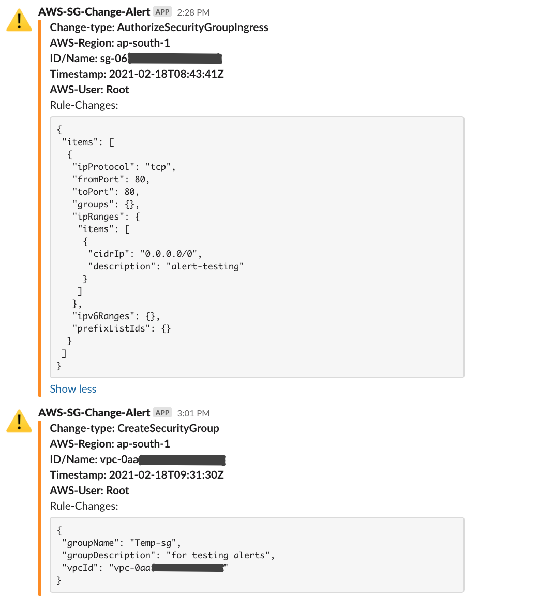

[](https://opensource.org/licenses/MIT)

## Overview
An AWS Lambda function for alerting to Slack when any changes are made to Security Groups

## Supported AWS CloudTrail events
```
AuthorizeSecurityGroupIngress
AuthorizeSecurityGroupEgress
RevokeSecurityGroupIngress
RevokeSecurityGroupEgress
CreateSecurityGroup
DeleteSecurityGroup
```

## Configuration
1. Configure an AWS Lambda function using the code in this repo (Python3.7 supported)\
*Note:*\
The following environment variables should be configured for Lambda function
```
SLACK_CHANNEL
SLACK_TOKEN
```
2. Enable AWS CloudTrail logging (if not already done) to log '*Management events*
' (single/multi Region trails are supported)
3. Create an AWS Cloudwatch Rule (found under the 'Events' section) with the following pattern
```
{
  "source": [
    "aws.ec2"
  ],
  "detail-type": [
    "AWS API Call via CloudTrail"
  ],
  "detail": {
    "eventSource": [
      "ec2.amazonaws.com"
    ],
    "eventName": [
      "AuthorizeSecurityGroupIngress",
      "AuthorizeSecurityGroupEgress",
      "RevokeSecurityGroupIngress",
      "RevokeSecurityGroupEgress",
      "CreateSecurityGroup",
      "DeleteSecurityGroup"
    ]
  }
}
```
4. Configure the AWS Lambda function as a target for AWS Cloudwatch Rule (in step-3), this will invoke the Lambda function when an event matches the given pattern.
5. (Optional) test the Lambda function using the dummy event provided in the file '*cloudtrail-event.json*'

## Slack alerts


## License
Code released under the [MIT License](https://opensource.org/licenses/MIT)